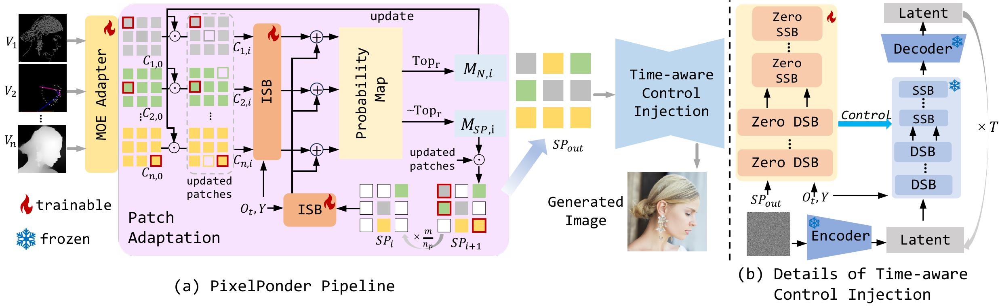

<div align="center">

<p align="center" style="border-radius: 30px">
    
</p>

# PixelPonder:Dynamic Patch Adaptation for Enhanced Multi-Conditional Text-to-Image Generation

<a href='https://hithqd.github.io/projects/PixelPonder/'></a>
[](https://arxiv.org/pdf/2503.06684)
[](https://github.com/chfyfr/PixelPonder)

</div>

# 💥News
- **`2025/3/11`**: Model can be accessed.
- **`2025/3/11`**: Inference code is released.
- **`2025/3/11`**: Our [**PixelPonder paper**](https://arxiv.org/pdf/2503.06684) is available.
- **`2025/6/4`**: Training code is released.

# 👨‍💻 ToDo
- [x] Release the training code
- [x] Release the inference code
- [x] Release the model

# 📖Pipeline
<div style="text-align: center;">

</div>
We propose PixelPonder, a novel mechanism which can refine the combination of multi-visual conditions by transitioning from the image level to the patch level, thereby enabling finer-grained controllable generation.

# 🛠️Installation Guide
1. Clone our repo:
```bash
git clone https://github.com/chfyfr/PixelPonder.git
```

2. Create new virtual environment:
```bash
conda create -n pixelponder python=3.10 -y
conda activate pixelponder
```

3. Choose the appropriate version of PyTorch: 
```bash
pip install torch==2.2.0 torchvision==0.17.0 torchaudio==2.2.0 --index-url https://download.pytorch.org/whl/cu118 
```

4. Install our dependencies by running the following command:
```bash
pip install -r requirements.txt
```

# 🚀Inference
We provide two types of inference scripts, including single-GPU inference and multi-GPU parallel inference.
1. single-GPU inference:  
In the case of offloading, we recommend a GPU memory capacity of 32GB. 
```bash
python inference.py
```
2. multi-GPU parallel inference:  
You can select the type of condition you want to input using the `--<condition>` option. For example, 
`--canny --depth` means to use only Canny and depth to control image generation.  
The data storage format can refer to the format in the **Training Dataset or Inference Dataset**.
```bash
python batch_inference.py --canny --depth --hed --openpose --batch 8 --gpu 4 --datapath "path/to/your/data" --savepath "path/to/your/save/path"
```

# 🚀Training
## Accelerate Configuration Example:
```yaml
compute_environment: LOCAL_MACHINE
debug: false
distributed_type: MULTI_GPU
downcast_bf16: 'no'
enable_cpu_affinity: false
gpu_ids: all
machine_rank: 0
main_training_function: main
mixed_precision: bf16
num_machines: 1
num_processes: 8
rdzv_backend: static
same_network: true
tpu_env: []
tpu_use_cluster: false
tpu_use_sudo: false
use_cpu: false
```

According to the accelerate configuration, we recommend using GPU with more than 80GB of VRAM for training.
```bash
accelerate launch train.py
```

# 🤖️Models
You can download them on HuggingFace:
- [pixelponder](https://huggingface.co/chfyfr/PixelPonder): pixelponder-fp32.bin
- [flux](https://huggingface.co/black-forest-labs/FLUX.1-dev): ae.safetensors, flux1-dev.safetensors, text_encoders
- [clip](https://huggingface.co/openai/clip-vit-large-patch14): all

After downloading, please place the weight files in the ckpts folder.

# 🧐Training Dataset or Inference Dataset
Dataset has the following format for the training process:
```text
├── data/
│    ├── images
│    │     ├──image_000.png
│    │     ├──image_001.png
│    │     ├──...
│    ├── canny
│    │     ├──image_000.png
│    │     ├──image_001.png
│    │     ├──...
│    ├── hed
│    │     ├──image_000.png
│    │     ├──image_001.png
│    │     ├──...
│    ├── depth
│    │     ├──image_000.png
│    │     ├──image_001.png
│    │     ├──...
│    ├── openpose
│    │     ├──image_000.png
│    │     ├──image_001.png
│    │     ├──...
│    ├── data.jsonl
```
The format of JSONL is as follows:
```text
{"image": "path/to/your/data/images/image_000.png", "text": "text1", "canny": "path/to/your/data/canny/image_000.png", "depth": "path/to/your/data/depth/image_000.png", "openpose": "path/to/your/data/openpose/image_000.png", "hed": "path/to/your/data/hed/image_000.png"}
{"image": "path/to/your/data/images/image_001.png", "text": "text2", "canny": "path/to/your/data/canny/image_001.png", "depth": "path/to/your/data/depth/image_001.png", "openpose": "path/to/your/data/openpose/image_001.png", "hed": "path/to/your/data/hed/image_001.png"}
```
In inference, the data/images are not needed.

## Models Licence
Our models fall under the [FLUX.1 [dev]](https://github.com/black-forest-labs/flux/blob/main/model_licenses/LICENSE-FLUX1-dev) and the [x-flux](https://github.com/XLabs-AI/x-flux) license.  

## Citation
If you find our work helpful for your research, please consider citing our work.
```
@article{pan2025pixelponder,
      title={PixelPonder: Dynamic Patch Adaptation for Enhanced Multi-Conditional Text-to-Image Generation},
      author={Pan, Yanjie and He, Qingdong and Jiang, Zhengkai and Xu, Pengcheng and Wang, Chaoyi and Peng, Jinlong  and Wang, Haoxuan and Cao, Yun and Gan, Zhenye and  Chi, Mingmin and Peng, Bo and Wang, Yabiao},
      journal={arXiv preprint arXiv:2503.06684},
      year={2025}
      }
```
