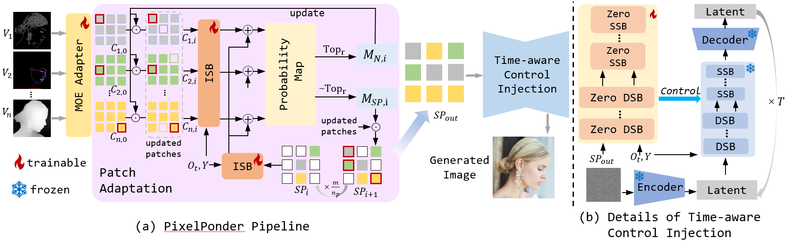

# PixelPonder
PixelPonder: Dynamic Patch Adaptation for Enhanced Multi-Conditional
Text-to-Image Generation


<a href=''>
  
</a>

[//]: # (<a href="">)

[//]: # (    )

[//]: # (</a>)
<a href=''>
  
</a>

[//]: # (<a href="" style="margin: 0 2px;">)

[//]: # (  )

[//]: # (</a>)

# Abstract
Recent advances in diffusion-based text-to-image generation have demonstrated promising results through visual condition control. However, existing ControlNet-like methods struggle with compositional visual conditioning - simultaneously preserving semantic fidelity across multiple heterogeneous control signals while maintaining high visual quality, where they employ separate control branches that often introduce conflicting guidance during the denoising process, leading to structural distortions and artifacts in generated images. To address this issue, we present PixelPonder, a novel unified control framework, which allows for effective control of multiple visual conditions under a single control structure. Specifically, we design a patch-level adaptive condition selection mechanism that dynamically prioritizes spatially relevant control signals at the sub-region level, enabling precise local guidance without global interference. Additionally, a time-aware control injection scheme is deployed to modulate condition influence according to denoising timesteps, progressively transitioning from structural preservation to texture refinement and fully utilizing the control information from different categories to promote more harmonious image generation. Extensive experiments demonstrate that PixelPonder surpasses
previous methods across different benchmark datasets, showing superior improvement in spatial alignment accuracy while maintaining high textual semantic consistency. Qualitative evaluations confirm our method's ability to synthesize photorealistic images that faithfully adhere to complex multi-condition inputs, significantly outperforming existing compositional control approaches.
<div style="text-align: center;">

</div>

# News
- **`2025/2/20`**: Inference code is released.
- **`2025/2/20`**: Our [**PixelPonder paper**](https://arxiv.org/) is available.


# Installation Guide
1. Clone our repo:
```bash
git clone https://github.com/chfyfr/PixelPonder.git
```

2. Create new virtual environment:
```bash
conda create -n pixelponder python=3.10 -y
conda activate pixelponder
```

3. Choose the appropriate version of PyTorch based on your CUDA version.: 
```bash
pip install torch==2.2.0 torchvision==0.17.0 torchaudio==2.2.0 --index-url https://download.pytorch.org/whl/cu118 
```

4. Install our dependencies by running the following command based on your CUDA version.:
```bash
pip install -r requirements.txt
```

# Inference
We provide two types of inference scripts, including single-GPU inference and multi-GPU parallel inference.
1. single-GPU inference:  
In the case of offloading, we recommend a GPU memory capacity of 32GB. If offloading is not used, we recommend a GPU 
memory capacity of 60GB.You can try using the Schnell version of Flux to further reduce memory requirements.
```bash
python inference.py
```
2. multi-GPU parallel inference:  
You can select the type of condition you want to input using the `--<condition>` option. For example, 
`--canny --depth` means to use only Canny and depth to control image generation.  
The data storage format can refer to the format in the **Training Dataset or Inference Dataset**.
```bash
python batch_inference.py --canny --depth --hed --openpose --batch 8 --gpu 4 --datapath "path/to/your/data" --savepath "path/to/your/save/path"
```


# Training Dataset or Inference Dataset
Dataset has the following format for the training process:
```text
├── data/
│    ├── images
│          ├──image_000.png
│          ├──image_001.png
│          ├──...
│    ├── canny
│          ├──image_000.png
│          ├──image_001.png
│          ├──...
│    ├── hed
│          ├──image_000.png
│          ├──image_001.png
│          ├──...
│    ├── depth
│          ├──image_000.png
│          ├──image_001.png
│          ├──...
│    ├── openpose
│          ├──image_000.png
│          ├──image_001.png
│          ├──...
│    ├── data.jsonl
```
The format of JSONL is as follows:
```text
{"image": "path/to/your/data/images/image_000.png", "text": "text1", "canny": "path/to/your/data/canny/image_000.png", "depth": "path/to/your/data/depth/image_000.png", "openpose": "path/to/your/data/openpose/image_000.png", "hed": "path/to/your/data/hed/image_000.png"}
{"image": "path/to/your/data/images/image_001.png", "text": "text2", "canny": "path/to/your/data/canny/image_001.png", "depth": "path/to/your/data/depth/image_001.png", "openpose": "path/to/your/data/openpose/image_001.png", "hed": "path/to/your/data/hed/image_001.png"}
```
In inference, the data/images are not needed.


